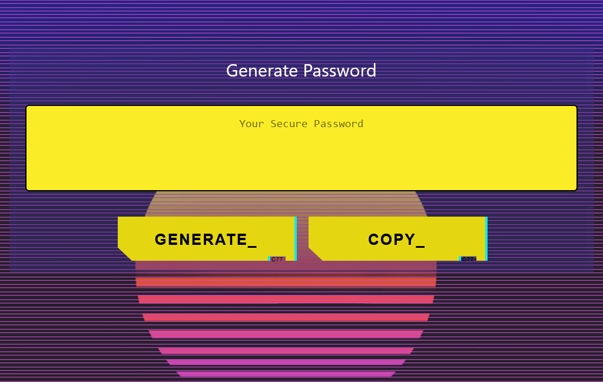

# KeyGen 2.0 

## Description

KeyGen 2.0 makes it easy to generate a password of variable length on the go. Powered by react and PWA-enabled, Keygen works on or offline, on the mobile device of your choice.

## Table of Contents

- [Installation](#installation)
- [Usage](#usage)
- [Credits](#credits)
- [Contributing](#contributing)
- [Questions](#questions)
- [Tests](#tests)
- [License](#license)

## Installation

Navigate to the deployed URL, then follow your devices' process to install a webapp.

## Usage

Simply enter the desired length of your password, and tap the Generate button. A phrase containing numbers, letters, and symbols will appear in moments. We highly recommend using a password vault to save the result.

## Credits

Special thanks go to all who helped me with the implementation of the original KeyGen, as this legacy code was crucial to this refactor.

## Contributing

N/A

## Questions?

Questions about this project can be directed to:

- Github: /puentebravo
- Email: puentematos@gmail.com

## Tests

N/A

## License

Content in this project is governed under the MIT License.

To read the license in its entirety, click here: [MIT](./LICENSE)

---

Copyright [2021] [Charlie Puente]
